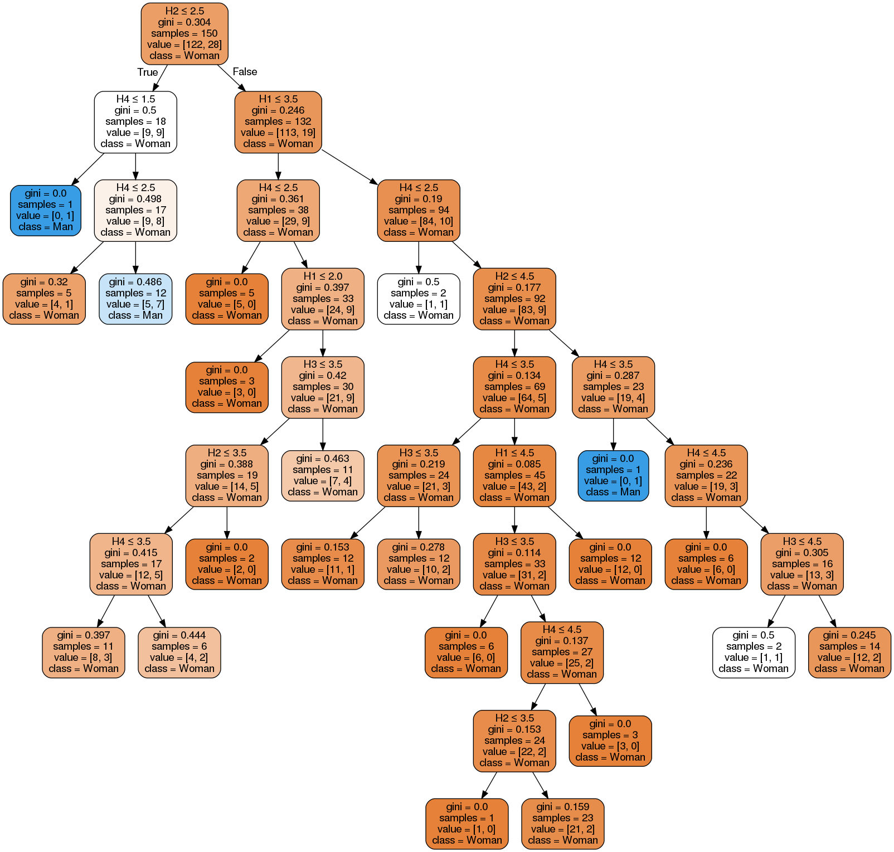
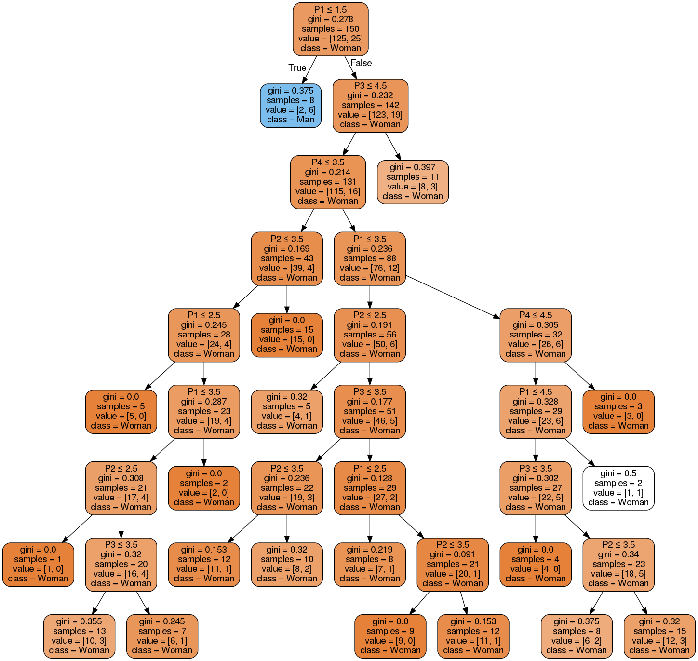
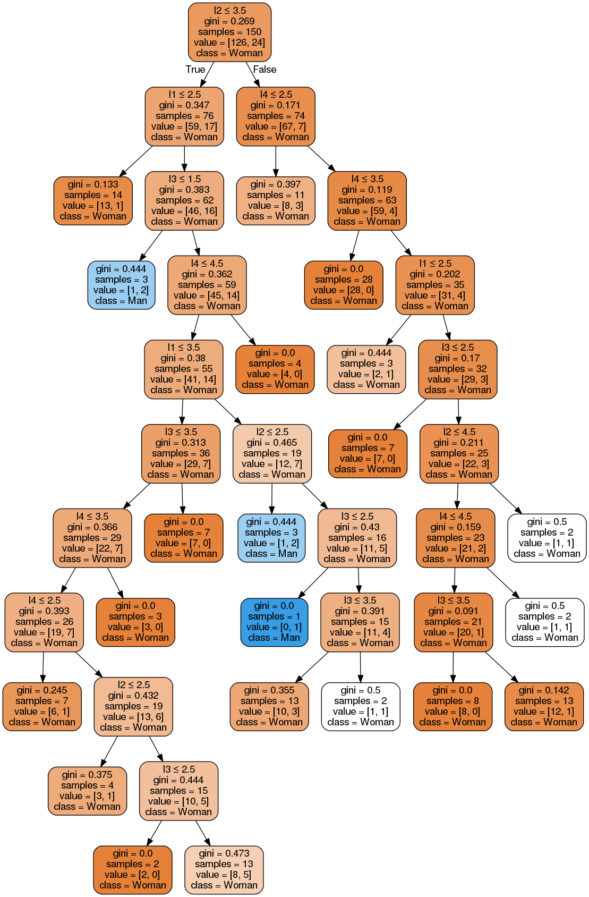
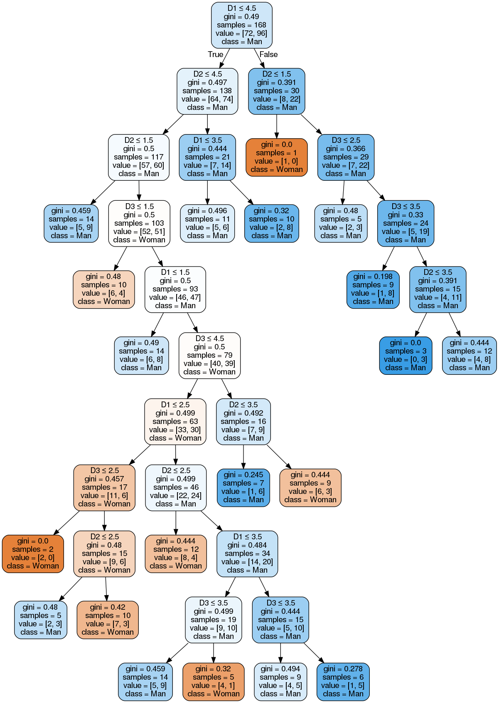
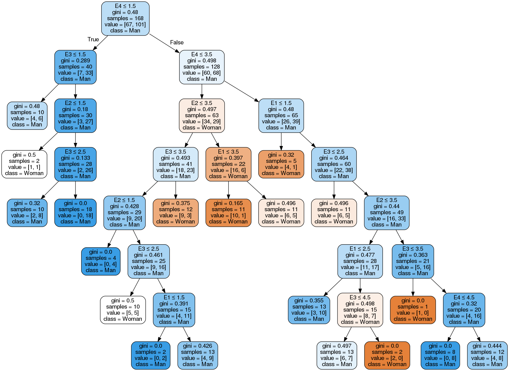

#  China_Korea_Shopping_Data_Processing

 - This project aims to create and explore Decision Tree for analysis of shopping data.

#  Dependency

- Python 3.x
-  scikit-learn
- pandas
- numpy
- pydotplus
- mlxtend
- IPython

# Data Label

|H | 쾌락 추구|
|--|--|
|H1|쇼핑을 좋아한다.|
|H2|우울할 때 쇼핑을 하면 기분이 좋아진다.|
|H3|쇼핑을 하는 것 자체가 나에게 즐거움을 준다.|
|H4|제품을 구입한 이후에도 계속 쇼핑하는 것을 좋아한다.|

|F | 유행 추구|
|--|--|
|F1|쇼핑을 할 때 편리함보다는 유행에 중점을 둔다.|
|F2|신상품을 남보다 먼저 사는 경향이 있다.|
|F3|유행이 지난 것은 사용하지 않는다.|
|F4|그 시즌에 유행하는 디자인을 주로 구입한다.|

|P| 실용 추구|
|--|--|
|P1|유행이 지난 것이라도 신경쓰지 않는 편이다.|
|P2|패션이나 유행은 얼마 지난 뒤 받아들이는 편이다.|
|P3|유행보다는 편안함에 중점을 두고 쇼핑을 한다.|
|P4|간편하고 편리한 옷을 좋아하는 편이다.|

|I | 개성 추구|
|--|--|
|I1|남과 다르게 보이는 것을 좋아한다.|
|I2|때로는 과감한 옷차림으로 이미지 변화를 희망한다.|
|I3|주의사람들이 자신의 옷차림 등에 대한 평가에 민감하다.|
|I4|특이한 디자인, 명품, 한정된 수량 제품 등을 좋아한다.|

|D|  편의 추구|
|--|--|
|D1|어떤 브랜드가 마음에 들면 계속 그 브랜드를 산다.|
|D2|마음에 드는 이미지나 분위기의 점포를 발견하면 계속 그 점포를 이용한다.|
|D3|쇼핑시 자신의 단골 점포를 주로 이용한다.|

|E | 경제성 추구|
|--|--|
|E1|쇼핑 전 미리 예산을 세우는 편이다.|
|E2|제품을 구입할 때 주로 세일기간이나 할인 쿠폰을 이용한다.|
|E3|제품을 구입하기 전에 여러 점포를 둘러보고 가격 비교한다.|
|E4|고품질, 저가격 제품을 구매하기 위해 시간을 더 투자한다.|

# Result : Decision Tree image
## 중국 유학생

## 

## 

##

##

##

## 중국 현지 학생

##

##

##

##

##

## 한국 특성화 학교

##

##

## 

##

##

## 한국 대학생

##

##

##

##

##

##
